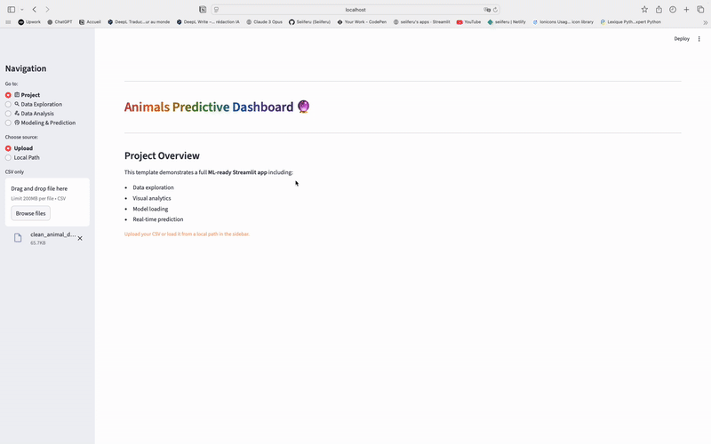
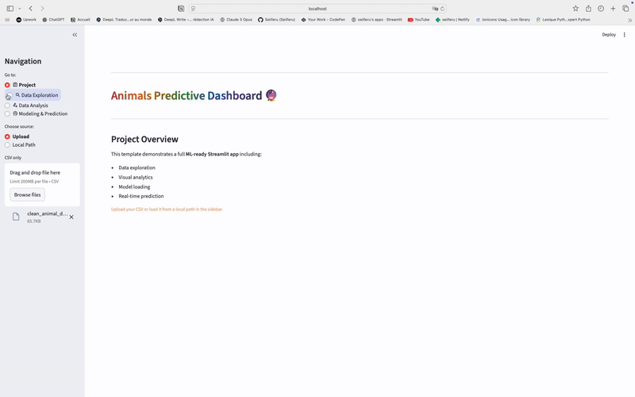
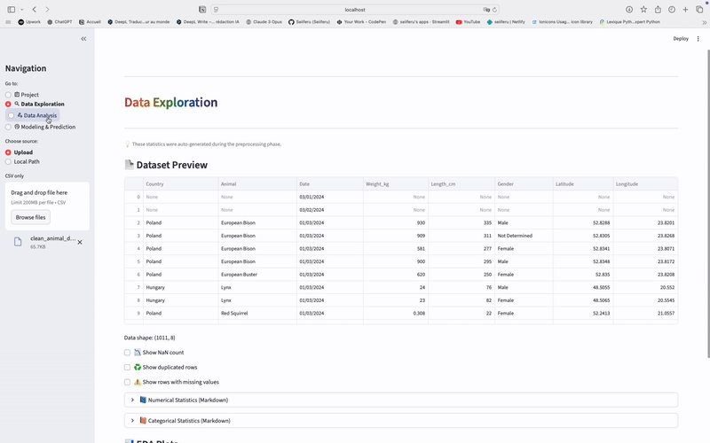
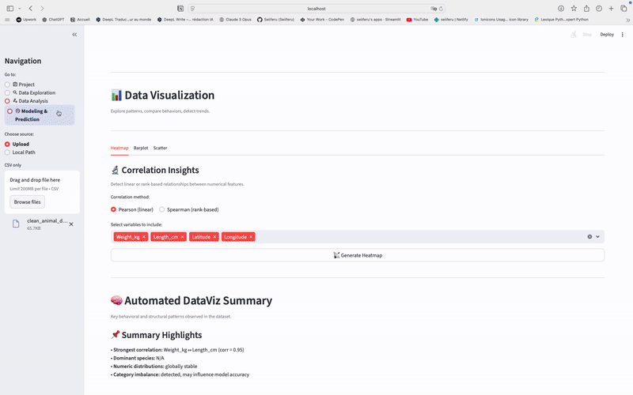

# 🐾 Animal Morphology & Weight Predictor — AetherTech Lab

👉 *A complete end-to-end ML system predicting animal morphology using species-specific models, global multi-output learning, clustering, EDA and a full Streamlit interface.*

[](https://animal-ml-predictor.streamlit.app/)


[](https://github.com/GeeksterLab/animal-ml-predictor/actions)
[](https://codecov.io/gh/GeeksterLab/animal-ml-predictor)

---

## 🎯 **Project Overview**

This project predicts:

- **Weight → Length**  
- **Length → Weight**  

for multiple animal species using dedicated per‑species models (Linear Regression & Gradient Boosting) + a global multi‑output Gradient Boosting model for scientific exploration.

Useful for wildlife analytics, zoology datasets, morphological inference or educational ML demonstrations.

It also includes:

- K‑Means clustering (morphology & geography)  
- Full EDA (distributions, heatmaps, scatterplots…)  
- A polished **Streamlit interface** with scientific explanations  
- Automated logs, tests & stats  

---

## 🎥 Application Preview

A quick visual tour of the main features of the **Animal Morphology & Weight Predictor**.

<details>
<summary><strong>🎥 View Interactive Application Preview</strong></summary>

### 🐾 1. Intro Overview


### 📊 2. Data Exploration


### 📈 3. Data Analysis


### 🤖 4. Modeling & Prediction


</details>


---

## 📂 Project Structure
```
animal_morphology_weight_predictor/
├── .github/
│   ├── workflows/                          
│       └── ci.yml
│
├── app/
│   └── app.py                        # Streamlit App (Full UX + AI Lab)
│
├── assets/
│   ├── intro.gif
│   ├── exploration.gif
│   ├── analysis.gif
│   └── prediction.gif
│
├── configuration/
│   └── logger_config.py              # Unified logging system
│
├── data/
│   ├── raw/                          # Dirty input data
│   │   ├── animal_data_dirty.csv
│   │   └── animal_data_dirty_reworked.csv
│   └── cleaned/                      # Clean dataset + clustering
│       ├── clean_animal_data.csv
│       └── ML/kmeans/data_with_clusters_kmeans.csv
│
├── logs/                             # All training & app logs (auto-generated)
│   └── ...                           
│
├── model/                            # All ML training scripts
│   ├── gradient_boosting_global.py
│   ├── gradient_boosting_length.py
│   ├── gradient_boosting_weight.py
│   ├── k_means_clustering.py
│   └── linear_regression.py
│
├── plots/                            # Plot generation (eda & data viz)
│   ├── bareplot.py
│   ├── distribution_eda.py
│   ├── heatmap_viz.py
│   ├── repartition_eda.py
│   ├── scatter.py
│   └── table_eda.py
│
├── results/
│   ├── feature/                      # Feature importances (per species)
│   │   ├── gradient_boosting/*.csv
│   │   └── linear_regression/*.csv
│   │
│   ├── model/ML/                     # Trained models (.pkl)
│   │   ├── gradient_boosting/*.pkl
│   │   ├── linear_regression/*.pkl
│   │   └── kmeans/*.pkl
│   │
│   ├── notebook/                     # Audit 
│   │
│   ├── modeling/ML/                  # Training visualizations
│   │   ├── gradient_boosting/*.png
│   │   ├── linear_regression/*.png
│   │   └── kmeans/*.png
│   │
│   ├── plots/EDA/                    # Pure EDA plots
│   ├── plots/visualization/          # Extra visualizations
│   │
│   └── stats/                        # Stats reports
│       ├── ML/*.csv
│       └── EDA/*.md
│
├── scripts/                          # Scripts
│   ├── cleaning.py
│   ├── loading.py
│   └── main.py
│
├── tests/                            # Unit tests
│   ├── cleaning/
│   ├── loading/
│   ├── main/
│   ├── utils/
│   └── conftest.py
│
├── utils/                            # Utility modules
│   ├── config_utils.py
│   ├── data_utils.py
│   ├── paths_utils.py
│   └── save_utils.py
│
├── .coverage                  
├── .coveragerc                  
├── autofix.py                 
├── coverage.xml                 
├── inspect_df.ipynb                  # Notebook for quick DF inspection
├── requirements.txt
├── README.md
└── pytest.ini

```

---


# 🧪 **Models Used**

### ✔ Per‑species models
- Linear Regression  
- Gradient Boosting  
➡ optimized separately for:  
**Lynx, European Bison, Red Squirrel, Hedgehog**

### ✔ Global Multi‑Output Model
Predicts:  
- **Length_cm**  
- **Weight_kg**  
from:  
- **Animal**  
- **Country**

Used for scientific visualization (PDP, embeddings, feature influence).

### ✔ K‑Means (K=2 & K=9)
Cluster analysis based on:
- Length  
- Weight  
- Latitude  
- Longitude  

---

# 📊 **EDA Highlights**

Included in `/results/plots/EDA/`:

- Distribution plots  
- Weight vs Length density by gender  
- Weight repartition by country  
- Geographic heatmaps  
- Scatterplots colored by species  

---


# 📈 **Metrics**

### **Linear Regression**

| Species        | R²   | MAE   | MSE     | R² CV mean |
| -------------- | ---- | ----- | ------- | ---------- |
| Lynx           | 0.04 | 16.34 | 429.57  | -85.48     |
| Hedgehog       | 0.22 | 2.65  | 10.6    | 0.05       |
| European Bison | 0.53 | 26.57 | 1044.94 | 0.57       |
| Red Squirrel   | 0.02 | 1.53  | 3.21    | 0.04       |


### **Gradient Boosting weight**

| Species        | R²   | MAE    | MSE      | R² CV mean |
| -------------- | ---- | ------ | -------- | ---------- |
| Lynx           | 0.76 | 2.11   | 7.7      | 0.45       |
| Hedgehog       | 0.32 | 0.14   | 0.03     | 0.33       |
| European Bison | 0.27 | 164.54 | 41718.92 | 0.4        |
| Red Squirrel   | 0.02 | 0.03   | 0.0      | -0.18      |


### **Gradient Boosting length**

| Species        | R²    | MAE   | MSE    | R² CV mean |
| -------------- | ----- | ----- | ------ | ---------- |
| European Bison | 0.61  | 26.11 | 874.19 | 0.52       |
| Hedgehog       | -0.23 | 3.21  | 16.6   | 0.02       |
| Lynx           | 0.71  | 8.11  | 130.79 | 0.02       |
| Red Squirrel   | -0.04 | 2.0   | 17.98  | -1.77      |


### **Global Multi‑Output Model (Length & Weight)**
- R² Length: **0.881**
- R² Weight: **0.807**
- MAE Length: **6.025**
- MAE Weight: **12.22**

---

## 💻 Streamlit Application
📌 **Path→** `app/app.py`  
Demo: [🔗 Streamlit App](https://animal-morphology-predictor.streamlit.app/) 

### Features:
- Prediction interface  
- Scientific sandbox (100 random values)  
- Plateau detection  
- Morphology map (Length vs Weight + cluster)  
- User guidance with domain‑specific wording  
- Expanders for UX clarity  
- Error-prevention logic (same input → hint message)

---

## ⚙️ Installation & Run

**Note:**
Option A → Developers & advanced users (contributing to the project) should use pyenv to match the exact Python version and avoid conflicts.
Option B → Standard users (simply running the app) can use a normal venv — more simple, more universal.

```bash
# 1️⃣ Clone the repo
git clone https://github.com/GeeksterLab/animal-ml-predictor.git
cd animal-ml-predictor

# 2️⃣ Create virtual environment

# ➤ Option A — Developers (pyenv)
pyenv virtualenv 3.11.7 animal-ml-predictor_env
pyenv activate animal-ml-predictor_env
pyenv local animal-ml-predictor_env

# ➤ Option B — Standard users (venv)
python -m venv venv
source venv/bin/activate  # macOS/Linux
venv\Scripts\activate     # Windows

# 3️⃣ Install dependencies
pip install -r requirements.txt

# 4️⃣ Run Streamlit app
streamlit run app/app.py
```
---

## 🧪 Tests & Couverture

Commandes :

```bash
pytest --cov=utils --cov=scripts tests/

pytest --cov=utils --cov=scripts  --cov-report=xml --cov-report=term-missing
```

CI/CD ready with GitHub Actions & Codecov.

---

## 🧰 Tech Stack

| Category                | Tools                            |
| ----------------------- | -------------------------------- |
| **Language**            | Python 3.10+                     |
| **Data**                | pandas, numpy                    |
| **Visualization**       | matplotlib, seaborn, plotly      |
| **Machine Learning**    | scikit-learn, joblib             |
| **App Web**             | Streamlit                        |
| **Date Parsing**        | dateparser                       |
| **Utilities**           | colorama (CLI), logging, pathlib |
| **Testing** (optionnel) | pytest, pytest-cov               |
| **CI/CD**               | GitHub Actions, Codecov          |


---

## 📎 Ressources
- Dataset : [Lien Kaggle](https://www.kaggle.com/code/joannanplkrk/cleaning-messy-data/notebook)  

---

## 📜 License
Licensed under MIT. See [LICENSE](LICENSE) for details.

---
## ✨ Auteur
🏢 **AetherTech | GeeksterLab**  
_Next-Level Intelligence for Next-Level Minds_  
📧 [GeeksterLab@outlook.com](mailto:GeeksterLab@outlook.com)

